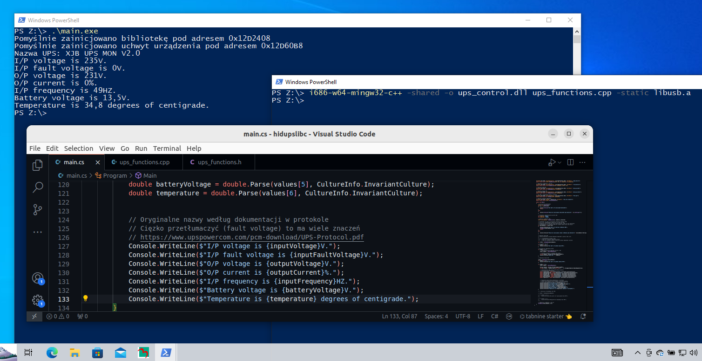

# Megatec UPS-Control library


### The library can be compiled natively, so you can use it in any programming language!

## How does it work?

This library provides functions for communication with a UPS (Uninterruptible Power Supply) according to the protocol described in [UPS Protocol Documentation](https://www.upspowercom.com/pcm-download/UPS-Protocol.pdf) and the Mega(USB) protocol, which I reverse-engineered based on the UPSilon 2000 software.

The **reverse engineering** involved analyzing how the dedicated program communicates with the UPS. There is no similar documentation available online. This is one of the first documents detailing this protocol, and I believe it is well-described.

I observed that the program communicates with the UPS using USB descriptors that the UPS handles through its internal circuitry. Retrieving USB descriptors from various indices allows access to different UPS functions. In some functions, the length of the GET_DESCRIPTOR query, i.e., `wLength`, also plays a role.

The library works with `libusb` (https://github.com/libusb/libusb), a cross-platform library for USB device handling.

## Descriptor index list

| Index | Returns | Function | Description |
|-------|-----------------|----------|-------------|
| 0     | Nothing              | No       | Greeting, used for Descriptor Type (Device, Configuration), not required. |
| 2     | UPS Name    | No       | |
| 3     | UPS Status  | No       | This index requires a double query (ACK) to get a correct response. Sending one query to index 3 will not return the correct UPS status. The library handles this automatically. |
| 4     | Nothing              | Yes      | 10-second Test |
| 5     | Nothing              | Yes      | Battery Exhaust Test |
| 6     | Nothing              | Yes      | X-Minute Test <br> In this case, the length of the query (`wLength`) corresponds to the number of minutes. However, you must first convert regular minutes to a value accepted by the UPS. |
| 7     | Nothing              | Yes      | Enable/Disable BEEP |
| 11    | Nothing              | Yes      | Cancel Test |
| 13    | UPS Rating  | No       | |
| 105   | Nothing              | Yes      | Power off UPS in 1 minute <br> During and after the UPS shutdown, the UPS status can still be retrieved. |

## UPS Status
The UPS status is returned by the library as a raw string. You need to parse it to get individual values. See the C# example `/examples/windows/main.cs` to see how to do it (start reading at line 88).

## Time conversion in `test_ups_with_time`

For the `test_ups_with_time` function, you can set the duration of the UPS test in minutes. I tested how the length (`wLength`) changes, which represents minutes in the descriptor.

1 minute corresponds to the value 101, 2 minutes to 102 – this increment rule is valid until the decimal range boundary.

For the range of 1 to 9 minutes, the last value is 9 minutes. The next value, which is in the next number range, is 10 minutes; however, in this case, the increment is 7.

For example:
- If the time is 15 minutes, it corresponds to the value 121.
    1. The maximum value for this range is 19 minutes, corresponding to the value 125.
    2. If the time exceeds 19 minutes, you must move to the next range.
    3. In this case, add 7 to the maximum value (125), resulting in a new value (125 + 7 = 132).
    4. Thus, if the time is 20 minutes, the value assigned is 132.

In summary, for each range of minutes, a specific value is assigned. If the time exceeds the maximum time in a given range, a constant value is added. In the example provided, this value is 7. The maximum value is 99 minutes, corresponding to 253.

## Compiling for Windows

The library, compiled and located in the releases, is built using the MinGW32 C++ compiler for the i686-w64 architecture.

**File:** `ups-control.dll` <br> **Type:** PE32 executable (DLL) (console) Intel 80386, for MS Windows

The compiled library is 32-bit because the virtual machine I have on my computer already has a 32-bit Windows 10 installed.

When compiling the library, add a parameter to the compiler to include the static `libusb-1.0` library available on GitHub (-static libusb-1.0).

If a “No such file or directory” error occurs regarding the static library on Windows, it’s because the command line in Windows misinterprets periods in file names. Rename the library from “libusb-1.0.a” to, for example, “libusb.a”.

[libusb-1.0.27 Release](https://github.com/libusb/libusb/releases/tag/v1.0.27)

For Windows systems, use the compiler parameter (-shared). Compilation for Linux/GNU systems is different.

## Compiling for GNU/Linux

The library, compiled and located in the releases, is built using the standard G++ compiler.

**File:** `ups-control.so` <br> **Type:** ELF 64-bit LSB shared object, x86-64, version 1 (SYSV), dynamically linked, BuildID[sha1]=27477ea27cd85fec279cba355b505a2c7e1d79e3, not stripped

In my case, I have a 64-bit system installed, but you can compile the library for 32-bit systems using the (-m32) parameter.

Also, you need to install `libusb-1.0` for GNU/Linux. By default, the GCC/G++ compiler pulls libraries from the (/usr/lib) location.

For Ubuntu distribution, use the package manager to install it:

```bash
sudo apt-get install libusb-1.0-0-dev
```

When compiling, include the library (-lusb-1.0) and add the obligatory (-fPIC) parameter to create a dynamic library (shared library) for Linux.

**You can also compile library for GNU/Linux in just one command using Makefile.**

## Functions

### Initialization and Context Functions

### `libusb_context* initialize()`

**Description:** Initializes the `libusb` library.

**Returns:**
- An initialized `libusb` context.
- If initialization fails, the function returns `NULL`.

### `libusb_device_handle* open_device(libusb_context *ctx, int vendor_id, int product_id)`

**Description:** Opens a USB device based on the Vendor ID (VID) and Product ID (PID).

Once `libusb` is successfully initialized, include its context in the function argument. To open a specific USB device, you also need the device's hardware identifier (Vendor ID and Product ID).

On GNU/Linux, you can check the hardware identifier using the `lsusb` command. On Windows, the hardware identifier can be found in Device Manager under the "Details" tab for the USB device.

**Returns:**
- A handle to the USB device.
- If the operation fails, the function returns `NULL`.

### `void close_device(libusb_device_handle *dev_handle, libusb_context *ctx)`

**Description:** Closes the USB device handle and exits the `libusb` context.

### Directly related functions

### `int get_string_descriptor(libusb_device_handle *dev_handle, int index, uint16_t wLength)`

**Description:** Manually sends a descriptor request to the USB device.

A buffer is created to store the response from the UPS, with a maximum length of 256 bytes. A `LIBUSB_REQUEST_GET_DESCRIPTOR` request is sent, listening for a STRING type response of length `wLength` and index specified in the function arguments.

The resulting string is null-terminated (`\0`) to maintain compatibility with most languages. The response is cleaned of double quotes, backticks, and parentheses, which are considered junk characters. Only visible ASCII characters in the range 32 to 126 are accepted.

**Returns:**
- `0` if a response is received successfully.
- `1` if a response is received but is too short (value `REQ_NO_RET_MAX`).
- `-1` if no response is received, which may indicate an error.

### `char* get_last_response()`

**Description:** Returns the last response received from the UPS.

After sending a library function, such as `get_ups_name`, the response can be obtained using `get_last_response`.

The maximum response size is 256 bytes.

**Returns:**
- The last response received from the UPS.

### `int get_ups_name(libusb_device_handle *dev_handle)`

**Description:** Retrieves the name of the UPS by sending a descriptor request for the appropriate index (see technical documentation).

The response includes the UPS name, which can be accessed via `get_last_response`.

**Example:** XJB UPS MON V2.0

**Returns:**
- Similar values as `get_string_descriptor`.

### `int get_ups_status(libusb_device_handle *dev_handle)`

**Description:** Retrieves the status of the UPS by sending a descriptor request for the appropriate index (see technical documentation).

Retrieving the UPS status requires sending two GET requests. The first request will not return a correct response, so an ACK (acknowledgment) request must be sent immediately after to ensure the UPS receives the confirmation.

The function pauses for one second before sending the next request.

The response includes the UPS status, accessible via `get_last_response`.

**Example:** 237.0 000.0 232.0 000 50.0 13.5 34.8 00001001

**Returns:**
- Similar values as `get_string_descriptor`.

### `int get_ups_status_no_ack(libusb_device_handle *dev_handle)`

**Description:** Retrieves the status of the UPS by sending a descriptor request for the appropriate index (see technical documentation).

This function sends only one status request without an ACK. Sending a single request will not return the UPS status.

The response includes the UPS status, accessible via `get_last_response`.

**Example:** 237.0 000.0 232.0 000 50.0 13.5 34.8 00001001

**Returns:**
- Similar values as `get_string_descriptor`.

### `int test_ups(libusb_device_handle *dev_handle)`

**Description:** Starts a 10-second UPS test.

The test status can be checked in the UPS status bit field (see protocol description).

**Returns:**
- By default, no response is returned, so expect a value of `1`. The return values are similar to those of `get_string_descriptor`.

### `int test_ups_until_battery_low(libusb_device_handle *dev_handle)`

**Description:** Starts a UPS test that will continue until the battery level is low.

**Returns:**
- By default, no response is returned, so expect a value of `1`. The return values are similar to those of `get_string_descriptor`.

### `int switch_ups_beep(libusb_device_handle *dev_handle)`

**Description:** Toggles the UPS beep on/off.

The beep status can be checked in the UPS status bit field (see protocol description).

**Returns:**
- By default, no response is returned, so expect a value of `1`. The return values are similar to those of `get_string_descriptor`.

### `int shutdown_ups(libusb_device_handle *dev_handle)`

**Description:** Powers off the UPS after 1 minute.

The shutdown status can be checked in the UPS status bit field (see protocol description). Communication with the device is still possible after the UPS is turned off.

**Returns:**
- By default, no response is returned, so expect a value of `1`. The return values are similar to those of `get_string_descriptor`.

### `int abort_ups_test(libusb_device_handle *dev_handle)`

**Description:** Stops an ongoing UPS test.

**Returns:**
- By default, no response is returned, so expect a value of `1`. The return values are similar to those of `get_string_descriptor`.

### `int get_ups_rating(libusb_device_handle *dev_handle)`

**Description:** Retrieves the UPS rating, including Rating Voltage, Rating Current, Battery Voltage, and Frequency as described in the protocol.

**Returns:**
- By default, no response is returned, so expect a value of `1`. The return values are similar to those of `get_string_descriptor`.

### `int test_ups_with_time(libusb_device_handle *dev_handle, int minutes)`

**Description:** Tests the UPS for a specified number of minutes.

**Returns:**
- Values from 1 to 99 minutes. If a value outside this range is provided, it returns `-1`.
- If the range is valid, returns the correctly computed value according to a specific algorithm.

## Credits
* https://github.com/pb0xxx (Piotr Bednarski)
